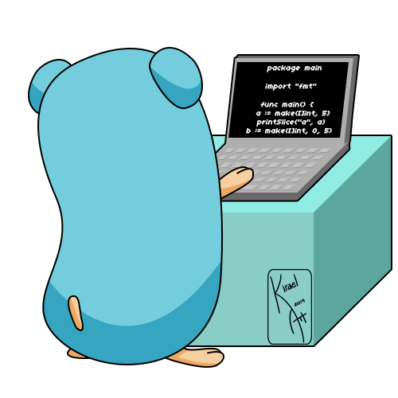

<h1 align="center">Hi 👋, I'm Zeynep Sevgi.</h1>

  

- 🔭  I'm currently working on backend development(Golang)

- 📝 I regularly write articles on [https://medium.com/@zeyneppsevgi](https://medium.com/@zeyneppsevgi)

- 📫 How to reach me **zeyneppsevgi@gmail.com**

<h3 align="left">Connect with me:</h3>

<h3 align="left">Languages and Tools:</h3>

            

<h3 align="left">Languages and Tools:</h3>

            

